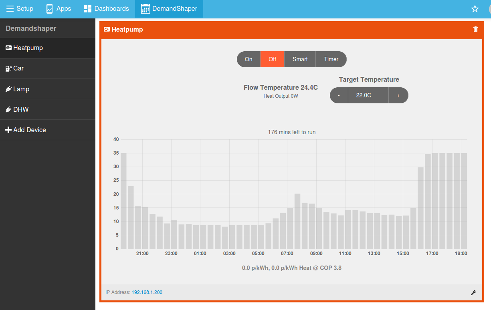
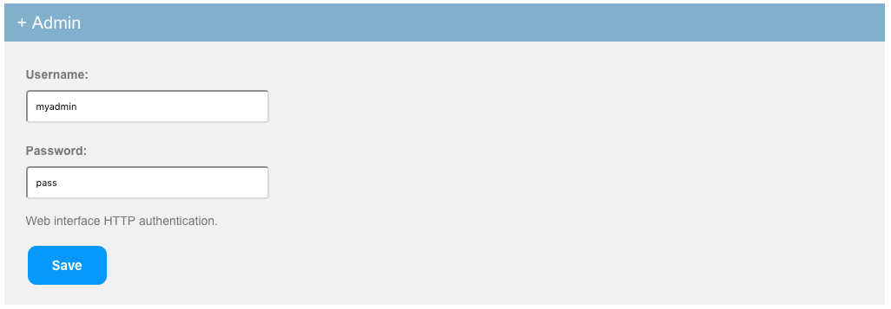

# Demand Shaper

Appliance, Smartplug, [WiFi Relay](https://shop.openenergymonitor.com/wifi-mqtt-relay-thermostat/), [EmonEVSE / OpenEVSE EV Charging Station](https://guide.openenergymonitor.org/integrations/ev-charging/), [HeatpumpMonitor](https://heatpumpmonitor.org/) demand shaper: Find the best time to run a household load.

The demand shaper module uses a day ahead power availability forecast and user set schedules to determine the best time to run household loads. An example could be charging an electric car, the user enters a desired completion time and charge duration, the demand shaper module then works out the best time to charge the car, generally there will be higher power availability overnight and during sunny midday hours. The demand shaper attempts to avoid running appliances at peak times while ensuring that the appliance has completed the required run period.

Developed as part of the CydYnni EnergyLocal project, see:
[https://community.openenergymonitor.org/t/cydynni-energylocal-community-hydro-smart-grid-blog-post](https://community.openenergymonitor.org/t/cydynni-energylocal-community-hydro-smart-grid-blog-post)

**9th November 2018:** The demand shaper module now supports the use of the [UK grid carbon intensity](https://carbonintensity.org.uk) and [Octopus Agile](https://octopus.energy/agile/) forecasts.

## Requirements

- Emoncms
- Emoncms Device module
- MQTT Mosquitto broker and MQTT emoncms setup as per emonSD image
- Redis

## Install

The DemandShaper module is pre-installed on the emonSD image that is shipped with OpenEnergyMonitor EmonPi and EmonBase devices. If you dont have a EmonPi or EmonBase but do have a spare RaspberryPi, the easiest way to use the DemandShaper module is to download the latest emonSD SD card image so that you have the full Emoncms stack. Alternatively it is possible to build the Emoncms stack from scratch (useful for non-Pi systems e.g a cloud VM) using EmonScripts, or if you already have an manual Emoncms installation see steps for manual installation below.

**Option 1: Use pre-built emonSD SD card image for a RaspberryPi

Download the latest image here: 
https://github.com/openenergymonitor/emonpi/wiki/emonSD-pre-built-SD-card-Download-&-Change-Log

**Option 2: Install full emoncms system including demandshaper module using EmonScripts**

Just run our automated emoncms installation script on a target system of choice, see: 
[https://github.com/openenergymonitor/EmonScripts](https://github.com/openenergymonitor/EmonScripts)

**Option 3: [Install demandshaper module within an existing emoncms installation](docs/manual-install.md)**

### [Sonoff S20 Smart Plug](https://guide.openenergymonitor.org/integrations/demandshaper-sonoff/)

### [OpenEVSE / EmonEVSE electric car smart charging](https://guide.openenergymonitor.org/integrations/demandshaper-openevse/)

The module contains custom interfaces for applications such as EV charging where you can drag drop the battery level state of charge to the desired target, the module then calculates the required run time based on the battery size and charger charge rate (hard coded at present, but will be configurable from the interface):

### Heatpump Control

Integrates the ability to control a Mitsubushi EcoDan heatpump with FTC2B controller connected to the OpenEnergyMonitor HeatpumpMonitor. Flow temperature and heating On/Off is settable from the interface.

---

Submit schedule:

    /emoncms/demandshaper/submit?schedule={
        "active":1,
        "period":3,
        "end":16,
        "repeat":[1,1,1,1,1,1,1],
        "interruptible":0,
        "runonce":false,
        "basic":0,
        "signal":"carbonintensity",
        "device":"openevse"
    }
    
    
Get schedule:

    /emoncms/demandshaper/get?device=mynode

Response:

    {
        "schedule":
        {
            "settings":
            {
                "name": "mynode",
                "device": "mynode",
                "device_type": "smartplug",
                "ctrlmode": "smart",
                "signal": "carbonintensity",
                "period": 3,
                "end": 16,
                "interruptible": 0,
                "timer_start1": 0,
                "timer_stop1": 0,
                "timer_start2": 0,
                "timer_stop2": 0,
                "repeat":
                [
                    1,
                    1,
                    1,
                    1,
                    1,
                    1,
                    1
                ],
                "runonce": false,
                "flowT": 30,
                "openevsecontroltype": "time",
                "batterycapacity": 20,
                "chargerate": 3.8,
                "ovms_vehicleid": "",
                "ovms_carpass": "",
                "balpercentage": 0.9,
                "baltime": 45,
                "ev_soc": 0.2,
                "ev_target_soc": 0.8,
                "ip": "",
                "end_timestamp": 1590418800
            },
            "runtime":
            {
                "periods":
                [
                    {
                        "start":
                        [
                            1590408000,
                            13
                        ],
                        "end":
                        [
                            1590418800,
                            16
                        ]
                    }
                ],
                "timeleft": 10800,
                "last_update_from_device": 0
            }
        }
    }

## Remote Cache

The remote cache currently run's on emoncms.org to reduce the potential API load on the Octopus and CarbonIntensity servers. The cache provides the following routes:

    https://emoncms.org/demandshaper/carbonintensity
    https://emoncms.org/demandshaper/octopus?gsp=A

To install and use the cache on your own server. Symlink emoncms-remote module to Modules folder:

    ln -s /home/username/demandshaper/emoncms-remote /var/www/emoncms/Modules/demandshaper

Add the cron entry:

    0 * * * * php /home/username/demandshaper/emoncms_remote_cache.php >> /var/log/demandshaper-cache.log

## Security

Already, MQTT control requires a password, this provides a basic level of security..
To minimise additional risk, be sure to create an admin username and password in emonESP, this will limit access to the device.

